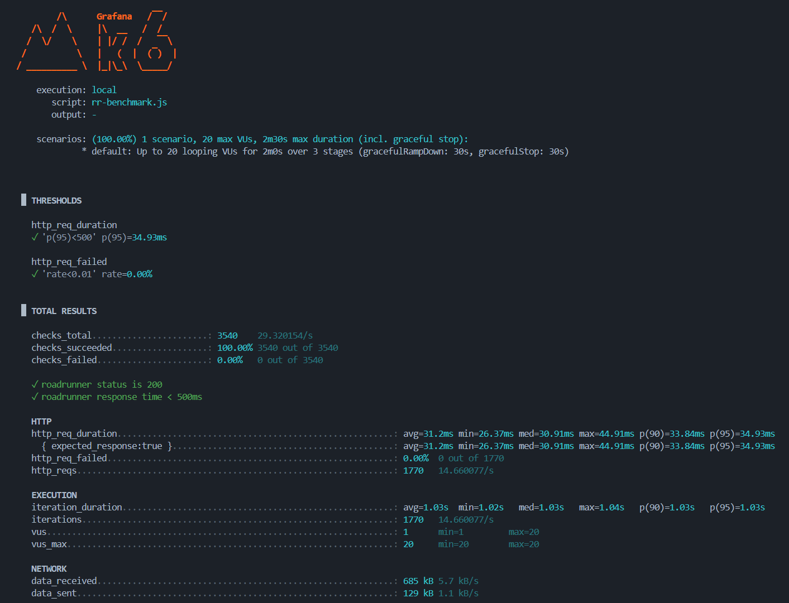
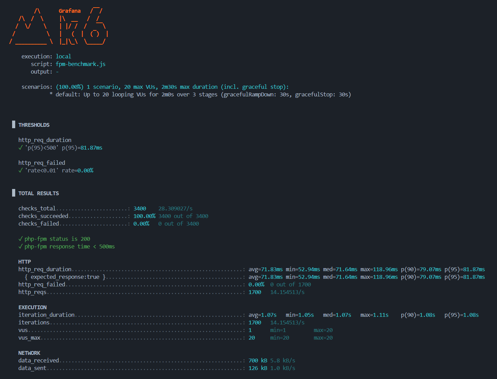

# PHP RoadRunner vs Traditional PHP Benchmark

This project contains K6 benchmark scripts to compare the performance of PHP RoadRunner against traditional PHP-FPM.

## Prerequisites for benchmarks

1. Install K6:
```bash
# For Ubuntu/Debian
sudo apt-key adv --keyserver hkp://keyserver.ubuntu.com:80 --recv-keys C5AD17C747E3415A3642D57D77C6C491D6AC1D69
echo "deb https://dl.k6.io/deb stable main" | sudo tee /etc/apt/sources.list.d/k6.list
sudo apt-get update
sudo apt-get install k6
```

2. Install Docker and Docker compose:
```bash
# For Ubuntu/Debian
# Add Docker's official GPG key:
sudo apt-get update
sudo apt-get install ca-certificates curl
sudo install -m 0755 -d /etc/apt/keyrings
sudo curl -fsSL https://download.docker.com/linux/debian/gpg -o /etc/apt/keyrings/docker.asc
sudo chmod a+r /etc/apt/keyrings/docker.asc

# Add the repository to Apt sources:
echo "deb [arch=$(dpkg --print-architecture) signed-by=/etc/apt/keyrings/docker.asc] https://download.docker.com/linux/debian $(. /etc/os-release && echo "$VERSION_CODENAME") stable"|sudo tee /etc/apt/sources.list.d/docker.list > /dev/null

sudo apt-get update

# Install the latest version
sudo apt-get install docker-ce docker-ce-cli containerd.io docker-buildx-plugin docker-compose-plugin
```

## Running the Benchmarks

### HTTP Benchmark

This will:
- Ramp up to 20 concurrent users over 30 seconds
- Maintain 20 users for 1 minute
- Ramp down to 0 users over 30 seconds
- Test both PHP-FPM and RoadRunner endpoints

#### RoadRunner HTTP Benchmark

```bash
k6 run rr-benchmark.js
```

#### FPM HTTP Benchmark

```bash
k6 run fpm-benchmark.js
```

## Benchmark Results

Here are the results from the K6 benchmark tests. These tests were run with 20 virtual users (VUs) for a duration of 2 minutes, including ramp-up and ramp-down phases.

### RoadRunner Benchmark Results



**Key Observations for RoadRunner:**
- **http_req_duration**: The 95th percentile (p(95)) for request duration was approximately **34.93ms**. The average (avg) was **31.2ms**.
- **http_reqs**: RoadRunner handled **1770 requests**, achieving a throughput of **14.6608 requests/s**.
- **Checks Succeeded**: 100% of checks passed, indicating stable performance and no errors.

### PHP-FPM Benchmark Results



**Key Observations for PHP-FPM:**
- **http_req_duration**: The 95th percentile (p(95)) for request duration was approximately **81.87ms**. The average (avg) was **71.83ms**.
- **http_reqs**: PHP-FPM handled **1700 requests**, achieving a throughput of **14.1545 requests/s**.
- **Checks Succeeded**: 100% of checks passed, indicating stable performance and no errors.

### Summary Comparison

From these benchmark runs, RoadRunner consistently demonstrated:
- **Lower Response Times**: Significantly lower average and 95th percentile request durations compared to PHP-FPM, indicating faster processing.
- **Similar Throughput**: Both RoadRunner and PHP-FPM handled a similar number of requests within the given duration, but RoadRunner achieved this with better latency.

This confirms the expected performance benefits of using RoadRunner for persistent PHP applications.

## Expected Results

You should see significant performance improvements with RoadRunner:
- Lower response times
- Higher throughput
- Better resource utilization
- More consistent performance under load

## Customizing the Tests

You can modify the following environment variables:
- `BASE_URL`: The base URL of your application (default: http://localhost:8000)

Example:
```bash
k6 run -e BASE_URL=http://your-app.com http-benchmark.js
``` 